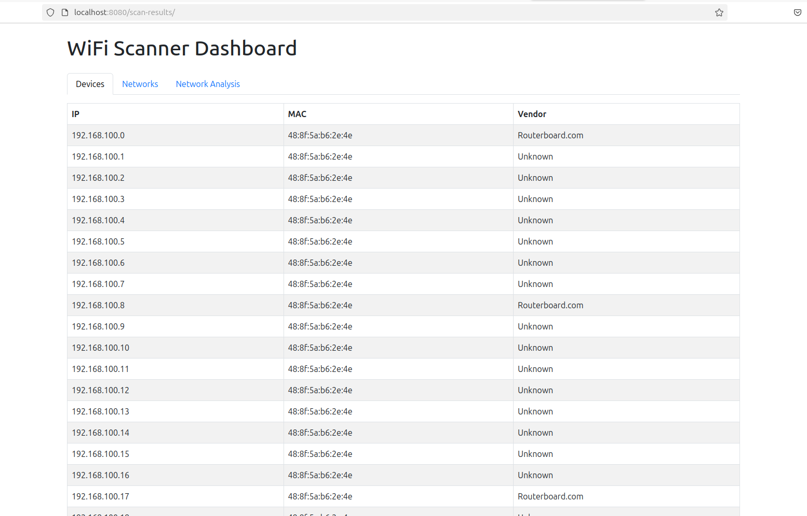

### WiFi Scanning with Python

This repository contains the Python source code and HTML files to view results in the browser.

## Table of Contents:
1. [System Requirements](#system-requirements)
2. [Cloning the Repository](#cloning-the-repository)
3. [Installing Dependencies](#installing-dependencies)
4. [Running the Scripts](#running-the-scripts)
5. [Viewing Results](#viewing-results)

## System Requirements
The scripts are written for Linux machines and do not support Windows, as some of the required packages (arp-scan, iwlist) are not directly available on Windows. These scripts have been tested on Ubuntu 24.04.

The program uses Python version 3.12. To ensure smooth execution of the scripts, make sure Python 3.12 is installed.

### Virtualization
Since we are scanning for WiFi networks and devices, the commands and scripts might not work accurately in VirtualBox or Docker. These results were generated by live-booting Ubuntu 24.04 from a USB stick.

## Cloning the Repository
Clone the repository either using the Git CLI or by downloading the ZIP file directly from the repository.

## Installing Dependencies
After cloning the repository, `cd` into the project folder named `pentest-project`. A Python virtual environment must be created before running the scripts.

If `venv` is not installed on the system, it must be installed first:

```
sudo apt install -y python3.12-venv # or the equivalent Python version's venv
```

Create a Python virtual environment with `venv`:

```bash
python3 -m venv venv
```

Activate the virtual environment:

```
chmod +x venv/bin/activate
source venv/bin/activate
```

Install the Python dependencies:

```
pip install -r requirements.txt # installs scapy and requests packages
```

## Running the Scripts
Root permissions are required to run the scripts. The main Python script must be run as the root user (using `sudo`). Running it directly with the system-level Python interpreter would result in an error because the root user might not have access to the virtual environment’s Python interpreter. Therefore, the Python binary inside the virtual environment should be used.

Before running the script, get the WiFi interface of the computer. The script will prompt for the computer's WiFi interface name. Make sure you are connected to WiFi and not Ethernet.

You can get your WiFi interface by running:

```bash
ip addr show
```

The default interface is usually `wlan0`, but in this example, it is `wlp0s20f3`.


Run the main Python script:

```
sudo venv/bin/python3 main.py
```

The script will output the available networks, connected devices, and a security analysis of the networks to `stdout`.

## Viewing Results
Run the `server.py` file to view the results in the browser:

```
sudo python3 server.py
```

Open [homepage](http://localhost:8080/scanned-results/index.html) to view the results.
